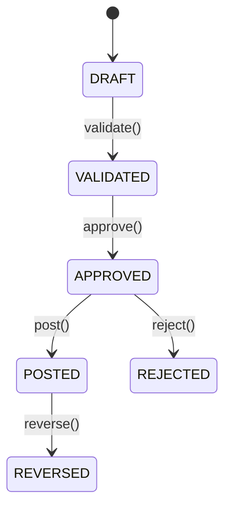

# AI‑Native ERP

> **Purpose:** This file tells Claude *how to work inside this repo*. It encodes our expectations, constraints, coding standards, financial‑domain rules (IFRS/GAAP‑aligned), and the way AI should assist without breaking accounting integrity.

------

## 1) Scope & Mission

- Claude supports:
  - Documentation (explain code, generate READMEs, diagrams).
  - Code tasks (tests, small refactors, scaffolding, typed stubs).
  - PR reviews (static checks, risk callouts, test‑gap detection).
  - Data & prompts (evaluate RAG prompts, propose test prompts, redact PII).
- Claude **must not**: touch secrets, rewrite migrations without explicit ask, invent accounting logic, or alter posted journals.

------

## 2) Repository Overview

- ● AIRP v2.0 - Comprehensive Repository Overview

    1. Domain & Business Context

    AIRP (AI-Powered Accounting & Reporting Platform) is an AI-Native Financial ERP system designed for UAE-based SMEs. It combines traditional accounting principles (GAAP/IFRS)
     with modern AI-powered automation for financial operations.

    Core Value Proposition:
    - Event Sourcing for complete audit trail and compliance (SOX)
    - AI-assisted transaction classification, reconciliation, and forecasting
    - Real-time financial reporting with materialized views
    - Multi-tenant SaaS architecture with UUID-based isolation
    - UAE market focus (AED currency, Dubai timezone, local compliance)

    Target Users:
    - Accountants & Controllers
    - AP/AR Clerks
    - Financial Analysts
    - CFOs & Finance Managers
    - Auditors

    2. Technology Stack

    Backend Services (NestJS + TypeScript)

    - Framework: NestJS 10.x with TypeORM
    - Language: TypeScript 5.x
    - Runtime: Node.js 20.x
    - Architecture: CQRS + Event Sourcing
    - API Style: REST + GraphQL (selected endpoints)

    AI Services (FastAPI + Python)

    - Framework: FastAPI 0.104.x
    - Language: Python 3.11
    - ML Libraries: scikit-learn, Prophet, transformers
    - LLM Integration: Anthropic Claude (primary), OpenAI (fallback)

    Infrastructure Components

    Data Layer:
    - PostgreSQL 15: Event store + Read models
    - Redis 7: Caching + Session management
    - Qdrant 1.7.4: Vector database for RAG
    - MinIO: S3-compatible object storage

    Event Streaming:
    - Redpanda (Kafka-compatible): Event bus
    - Kafka Console: Topic management UI

    Identity & Security:
    - Keycloak 23.0: OAuth2/OIDC authentication
    - JWT: Session tokens

    Monitoring & Observability:
    - Prometheus: Metrics collection
    - Grafana: Dashboards & visualization
    - Jaeger: Distributed tracing (OpenTelemetry)

    Containerization:
    - Docker + Docker Compose: Service orchestration
    - Alpine Linux: Base images for size optimization

    3. Directory Structure & Purpose

    C:\Dev\AIRP2\
    │
    ├── services/                          # Microservices (NestJS + Python)
    │   ├── ledger-writer/                 # Port 3001 - Journal Entry Write Model
    │   ├── projection-service/            # Port 3002 - CQRS Read Model Consumer
    │   ├── ap-service/                    # Port 3003 - Accounts Payable
    │   ├── ar-service/                    # Port 3004 - Accounts Receivable
    │   ├── treasury-service/              # Port 3005 - Cash Management
    │   ├── fpna-service/                  # Port 3006 - FP&A (Budgeting/Forecasting)
    │   ├── policy-engine/                 # Port 3007 - Approval Workflows
    │   ├── reporting-service/             # Port 3008 - Financial Reports
    │   ├── ai-auto-accounting/            # Port 8001 - AI Transaction Classification
    │   ├── ai-recon/                      # Port 8002 - AI Bank Reconciliation
    │   ├── ai-forecast/                   # Port 8003 - AI Cash Flow Forecasting
    │   ├── ai-narrative/                  # Port 8004 - AI Report Generation
    │   ├── ai-policy-advisor/             # Port 8005 - AI Policy Recommendations
    │   └── ai-query-parser/               # Port 8006 - NLP to SQL Translation
    │
    ├── schemas/                           # Database Schemas
    │   └── sql/
    │       ├── ddl.sql                    # Complete database schema
    │       └── seeds/                     # Seed data (Chart of Accounts, vendors, etc.)
    │
    ├── docs/                              # Documentation
    │   ├── architecture/                  # System architecture diagrams
    │   ├── api/                           # API specifications
    │   └── user-guides/                   # End-user documentation
    │
    ├── scripts/                           # Utility Scripts
    │   ├── test-ai-classification.py      # AI service testing
    │   ├── test-load-performance.py       # Load testing
    │   └── test-all-services.ps1          # PowerShell service health check
    │
    ├── ml/                                # Machine Learning Assets
    │   └── models/                        # Trained ML models
    │       ├── gl_classifier_v1.pkl       # GL account classifier
    │       ├── recon_matcher_v1.pkl       # Reconciliation matcher
    │       └── prophet_cash_v1.pkl        # Cash flow forecasting
    │
    ├── infra/                             # Infrastructure Configuration
    │   └── config/
    │       ├── prometheus.yml             # Prometheus scrape config
    │       └── grafana/                   # Grafana datasources & dashboards
    │
    ├── test-data/                         # Test Fixtures
    │   ├── sample-invoices/               # PDF/XML invoice samples
    │   └── bank-statements/               # CSV bank statement samples
    │
    ├── *.html                             # Frontend Demo Applications
    │   ├── ledgers-dashboard.html         # Main financial dashboard
    │   ├── chaterp.html                   # ChatERP AI interface
    │   ├── classify-demo.html             # Classification demo
    │   ├── policy-demo.html               # Policy advisor demo
    │   ├── cashflow-demo.html             # Forecast demo
    │   ├── recon-demo.html                # Reconciliation demo
    │   └── narrative-demo.html            # Report generation demo
    │
    ├── docker-compose.yml                 # Complete infrastructure orchestration
    ├── .env.example                       # Environment variable template
    ├── ACCOUNTING_PROTOCOLS.md            # Accounting standards documentation
    ├── QUICKSTART.md                      # Getting started guide
    └── README.md                          # Project overview

    4. Service Architecture

    Write Model (Event Sourcing)

    Ledger Writer Service (Port 3001):
    - Receives journal entry commands
    - Validates double-entry bookkeeping rules
    - Persists to event_store table (immutable)
    - Publishes events to Kafka (airp.events.journal-entry-posted)
    - Technologies: NestJS, TypeORM, KafkaJS

    Event Store Schema:
    event_store (
      event_id UUID PRIMARY KEY,
      aggregate_id UUID,           -- Journal Entry ID
      event_type VARCHAR,           -- 'JournalEntryPosted'
      event_data JSONB,             -- Complete journal entry
      tenant_id UUID,
      user_id UUID,
      timestamp TIMESTAMP,
      checksum VARCHAR(64)          -- SHA-256 for integrity
    )

    Read Model (CQRS Projections)

    Projection Service (Port 3002):
    - Consumes events from Kafka
    - Materializes read models:
      - gl_balances - Account balances by fiscal period
      - trial_balance - Materialized view
      - ap_aging - AP aging buckets
      - ar_aging - AR aging buckets
    - Refreshes materialized views on event consumption
    - Technologies: NestJS, KafkaJS (manual consumer), TypeORM

    Key Projections:
    gl_balances (
      account_id, fiscal_year, fiscal_period,
      debit_amount, credit_amount, balance
    )

    trial_balance (MATERIALIZED VIEW)
      - LEFT JOIN from chart_of_accounts
      - Aggregates gl_balances across all periods
      - Shows all accounts including zero-balance

    Sub-Ledger Services

    AP Service (Port 3003):
    - Vendor invoice management
    - Payment scheduling
    - AP aging calculation
    - Publishes InvoiceReceived events

    AR Service (Port 3004):
    - Customer invoice management
    - Collections tracking
    - AR aging calculation
    - Publishes InvoiceIssued events

    Treasury Service (Port 3005):
    - Bank account management
    - Cash position tracking
    - Payment execution
    - Publishes PaymentExecuted events

    FP&A Service (Port 3006):
    - Budget creation and tracking
    - Variance analysis
    - Forecast management

    Policy Engine (Port 3007):
    - Approval workflow rules
    - Multi-level approvals
    - Policy violation detection

    Reporting Service (Port 3008)

    Endpoints Implemented:
    - GET /reports/trial-balance - Trial balance
    - GET /reports/income-statement - P&L statement
    - GET /reports/balance-sheet - Balance sheet
    - GET /reports/cash-flow - Cash flow statement
    - GET /reports/aging/ap - AP aging report
    - GET /reports/aging/ar - AR aging report
    - GET /reports/vendor-ledger - Vendor sub-ledger
    - GET /reports/vendor-transactions - GL vendor transactions
    - GET /reports/customer-ledger - Customer sub-ledger
    - GET /reports/account-balances - Account balance summary
    - GET /reports/export/excel - Excel export

    Technologies: NestJS, TypeORM, ExcelJS, raw SQL queries

    AI Microservices (Python FastAPI)

    1. AI Transaction Classification (Port 8001)
    - Classifies transactions to GL accounts
    - Confidence scoring
    - Learning from historical patterns
    - API: POST /classify

    2. AI Reconciliation Engine (Port 8002)
    - Bank statement matching
    - Fuzzy matching algorithms
    - Auto-reconciliation suggestions
    - API: POST /reconcile

    3. AI Cash Flow Forecasting (Port 8003)
    - Prophet time-series forecasting
    - Seasonal decomposition
    - API: POST /forecast

    4. AI Narrative Generation (Port 8004)
    - Natural language report summaries
    - Management commentary generation
    - API: POST /generate-narrative

    5. AI Policy Advisor (Port 8005)
    - RAG-based policy recommendations
    - Qdrant vector search
    - Compliance checking
    - API: POST /advise

    6. AI Query Parser (Port 8006)
    - Natural language to SQL translation
    - Intent classification
    - Database schema awareness
    - API: POST /parse-query, POST /format-response

    5. Database Schema Overview

    Core Tables

    Chart of Accounts:
    chart_of_accounts (
      account_id UUID PRIMARY KEY,
      tenant_id UUID,
      account_code VARCHAR(20),     -- 1000-5999
      account_name VARCHAR(255),
      account_type VARCHAR(50),      -- Asset, Liability, Equity, Revenue, Expense
      account_subtype VARCHAR(50),
      normal_balance VARCHAR(10),    -- DEBIT or CREDIT
      parent_account_id UUID,
      is_leaf BOOLEAN,
      is_active BOOLEAN
    )

    Journal Entries (Write Model):
    journal_entries (
      entry_id UUID PRIMARY KEY,
      tenant_id UUID,
      entry_number VARCHAR(50),      -- JE-2025-001
      entry_date DATE,
      posting_date DATE,
      entry_type VARCHAR(50),        -- General, Adjusting, Closing, etc.
      source_type VARCHAR(50),       -- Manual, AI-Generated, API
      description TEXT,
      total_debit NUMERIC(20,2),
      total_credit NUMERIC(20,2),
      status VARCHAR(20),            -- draft, posted, reversed
      ai_confidence_score FLOAT
    )

    journal_entry_lines (
      line_id UUID PRIMARY KEY,
      entry_id UUID,
      account_id UUID,
      debit_amount NUMERIC(20,2),
      credit_amount NUMERIC(20,2),
      description TEXT,
      -- Sub-ledger dimensions
      dimension_1 UUID,              -- Vendor ID (AP)
      dimension_2 UUID,              -- Customer ID (AR)
      dimension_3 UUID,              -- Project ID
      dimension_4 UUID,              -- Cost Center ID
      metadata JSONB                 -- Invoice #, due date, etc.
    )

    AP/AR Sub-Ledgers:
    ap_invoices (
      invoice_id UUID PRIMARY KEY,
      tenant_id UUID,
      vendor_id UUID,
      invoice_number VARCHAR(100),
      invoice_date DATE,
      due_date DATE,
      payment_terms VARCHAR(50),
      total_amount NUMERIC(20,2),
      amount_paid NUMERIC(20,2),
      amount_outstanding NUMERIC(20,2),
      payment_status VARCHAR(20),    -- unpaid, partial, paid
      gl_entry_id UUID               -- Links to journal_entries
    )

    vendors (
      vendor_id UUID PRIMARY KEY,
      tenant_id UUID,
      vendor_code VARCHAR(50),
      vendor_name VARCHAR(255),
      contact_email VARCHAR(255),
      payment_terms VARCHAR(50),
      tax_id VARCHAR(50)
    )

    GL Balances (Read Model):
    gl_balances (
      tenant_id UUID,
      account_id UUID,
      fiscal_year INT,
      fiscal_period INT,             -- 1-12
      currency VARCHAR(3),
      debit_amount NUMERIC(20,2),
      credit_amount NUMERIC(20,2),
      balance NUMERIC(20,2),
      last_event_id UUID,
      UNIQUE (tenant_id, account_id, fiscal_year, fiscal_period, currency)
    )

    Trial Balance (Materialized View):
    CREATE MATERIALIZED VIEW trial_balance AS
    SELECT
      coa.account_id,
      coa.account_code,
      coa.account_name,
      coa.account_type,
      coa.normal_balance,
      COALESCE(SUM(gb.debit_amount), 0) AS total_debits,
      COALESCE(SUM(gb.credit_amount), 0) AS total_credits,
      CASE
        WHEN coa.normal_balance = 'DEBIT'
        THEN COALESCE(SUM(gb.debit_amount), 0) - COALESCE(SUM(gb.credit_amount), 0)
        ELSE COALESCE(SUM(gb.credit_amount), 0) - COALESCE(SUM(gb.debit_amount), 0)
      END AS balance
    FROM chart_of_accounts coa
    LEFT JOIN gl_balances gb ON coa.account_id = gb.account_id
    GROUP BY coa.account_id, coa.account_code, coa.account_name, coa.account_type, coa.normal_balance
    ORDER BY coa.account_code;

    6. Key Architectural Patterns

    1. Event Sourcing

    - All state changes captured as immutable events
    - Event store is source of truth
    - Complete audit trail with checksums
    - Events never modified or deleted
    - Projections can be rebuilt from events

    Example Event:
    {
      "event_id": "uuid",
      "event_type": "JournalEntryPosted",
      "aggregate_id": "journal-entry-uuid",
      "tenant_id": "tenant-uuid",
      "user_id": "user-uuid",
      "timestamp": "2025-01-15T10:30:00Z",
      "event_data": {
        "entryNumber": "JE-2025-001",
        "entryDate": "2025-01-15",
        "totalDebit": 30000,
        "totalCredit": 30000,
        "lines": [
          {"accountCode": "1200", "debitAmount": 30000, "vendorId": "uuid"},
          {"accountCode": "4000", "creditAmount": 30000}
        ]
      },
      "checksum": "sha256-hash"
    }

    2. CQRS (Command Query Responsibility Segregation)

    - Write Model: Ledger Writer → Event Store
    - Read Model: Projection Service → GL Balances, Trial Balance
    - Separate databases for write and read (same PostgreSQL, different tables)
    - Optimized queries without impacting writes

    3. Multi-Tenancy

    - UUID-based tenant isolation
    - All tables have tenant_id column
    - Row-level security policies
    - Tenant context in JWT token

    4. Sub-Ledger with Dimensions

    - Dimensions stored in journal_entry_lines.dimension_1-4
    - Vendor tracking via dimension_1
    - Customer tracking via dimension_2
    - Allows GL-level audit trail with sub-ledger linkage

    5. AI-Assisted Workflows

    - Confidence scoring for AI suggestions
    - Human review required for confidence < 0.8
    - AI reasoning captured in metadata
    - Fallback to manual entry on AI failure

    6. Materialized Views for Performance

    - trial_balance view refreshed on event consumption
    - LEFT JOIN to show all accounts (including zero-balance)
    - Indexed for fast query performance

    7. Idempotency & Deduplication

    - Event IDs used for deduplication
    - Kafka consumer offset tracking
    - Prevents duplicate processing

    7. Port Mapping Summary

  | Service            | Port      | Technology       | Purpose           |
  | ------------------ | --------- | ---------------- | ----------------- |
  | PostgreSQL         | 5432      | PostgreSQL 15    | Database          |
  | Kafka              | 19092     | Redpanda         | Event bus         |
  | Kafka Console      | 8080      | Redpanda Console | Kafka UI          |
  | Redis              | 6379      | Redis 7          | Cache             |
  | Qdrant             | 6333      | Qdrant           | Vector DB         |
  | MinIO              | 9000/9001 | MinIO            | Object storage    |
  | Keycloak           | 8081      | Keycloak         | Auth              |
  | Prometheus         | 9090      | Prometheus       | Metrics           |
  | Grafana            | 3100      | Grafana          | Dashboards        |
  | Jaeger             | 16686     | Jaeger           | Tracing           |
  | Ledger Writer      | 3001      | NestJS           | Write model       |
  | Projection Service | 3002      | NestJS           | Read model        |
  | AP Service         | 3003      | NestJS           | AP sub-ledger     |
  | AR Service         | 3004      | NestJS           | AR sub-ledger     |
  | Treasury           | 3005      | NestJS           | Cash mgmt         |
  | FP&A               | 3006      | NestJS           | Budgeting         |
  | Policy Engine      | 3007      | NestJS           | Approvals         |
  | Reporting          | 3008      | NestJS           | Reports           |
  | AI Classification  | 8001      | FastAPI          | GL classification |
  | AI Reconciliation  | 8002      | FastAPI          | Bank recon        |
  | AI Forecast        | 8003      | FastAPI          | Cash forecast     |
  | AI Narrative       | 8004      | FastAPI          | Report gen        |
  | AI Policy Advisor  | 8005      | FastAPI          | Policy advice     |
  | AI Query Parser    | 8006      | FastAPI          | NLP to SQL        |

    8. Key Features Implemented

    Accounting:
    - Double-entry bookkeeping with validation
    - Multi-currency support (base: AED)
    - Fiscal period tracking
    - Reversal entries (no deletions)
    - Sub-ledger reconciliation

    Reporting:
    - Trial Balance (all accounts)
    - Income Statement
    - Balance Sheet
    - Cash Flow Statement
    - AP/AR Aging Analysis
    - Vendor/Customer Ledgers
    - Excel export

    AI Capabilities:
    - Transaction auto-classification
    - Bank reconciliation matching
    - Cash flow forecasting (Prophet)
    - Report narrative generation
    - Policy recommendations (RAG)
    - Natural language query (ChatERP)

    Compliance:
    - GAAP/IFRS compliant
    - SOX audit trail
    - Immutable event log with checksums
    - 7-year data retention
    - Role-based access control (Keycloak)

    9. Getting Started

    # Clone repository
    cd C:/Dev/AIRP2

    # Set environment variables
    cp .env.example .env
    # Edit .env with ANTHROPIC_API_KEY

    # Start all services
    docker compose up -d

    # Check service health
    docker compose ps

    # View logs
    docker compose logs -f ledger-writer

    # Access UIs
    # - Ledgers Dashboard: http://localhost:5000/ledgers-dashboard.html
    # - ChatERP: http://localhost:5000/chaterp.html
    # - Kafka Console: http://localhost:8080
    # - Grafana: http://localhost:3100 (admin/admin)

  ---
    This repository implements a production-grade, AI-native financial ERP with event sourcing, CQRS, and comprehensive accounting compliance for UAE-based SMEs.

------


## 3) Accounting Hard Rules (Non‑negotiable)

1. **Double‑entry invariant:** Sum(debits) == Sum(credits) per journal entry.
2. **Posting immutability:** Once `status=POSTED`, entries are **append‑only**. Corrections via **reversals** or **adjusting entries** only.
3. **Period control:** No postings in closed/locked periods. Respect fiscal calendars.
4. **Chart of Accounts (CoA):** Use configured CoA; new accounts require explicit governance.
5. **IFRS/GAAP alignment:** Mapping from business events → entry templates must be traceable to policy.
6. **Audit trail:** Every transformation must have actor, timestamp, hash/ETag, reason code.
7. **SoD:** Creator ≠ Approver for material postings. Enforce maker–checker.
8. **Currency & FX:** Use dated rates; retain source rate and policy (spot/avg/closing) in metadata.
9. **Entity/Cost objects:** All entries must carry legal entity, profit center, cost center/project as applicable.
10. **Attachments:** Store immutable references (hash) to source docs (invoice, GRN, etc.).

> **Instruction to Claude:** If a requested change would violate any rule above, **refuse** and propose a compliant alternative.

------

## 4) AI Interaction Principles

- **Truth > Verbosity.** Prefer precise, minimal, and cited responses.
- **No fabricated data.** If context is missing, state uncertainty and request the exact file/line.
- **Guardrails:**
  - Never recommend editing posted journals.
  - Never generate code that bypasses validations or period locks.
  - Never output secrets or real tokens; use placeholders.
- **Explainability:** Provide brief rationale and impacted modules when proposing changes.

------

## 5) Style & Conventions

- **Python:** PEP8 + Ruff; type hints required; `pydantic` models for I/O schemas.
- **Commits:** Conventional Commits (e.g., `feat(ledger): add reversal workflow`).
- **Docs:** Markdown with fenced code, tables for schemas, Mermaid for diagrams.
- **Naming:** Clear domain terms (`JournalEntry`, `Posting`, `ApprovalWorkflow`).
- **Tests:** Pytest; AAA (Arrange‑Act‑Assert); fast deterministic tests.

------

## 6) Module Contracts (excerpts)

### 6.1 Journal Entry JSON Schema (I/O)

```json
{
  "$schema": "https://json-schema.org/draft/2020-12/schema",
  "title": "JournalEntryCreate",
  "type": "object",
  "required": ["date", "lines", "currency", "entity_id", "source"],
  "properties": {
    "date": {"type": "string", "format": "date"},
    "currency": {"type": "string", "pattern": "^[A-Z]{3}$"},
    "entity_id": {"type": "string"},
    "source": {"type": "string"},
    "memo": {"type": "string"},
    "lines": {
      "type": "array",
      "minItems": 2,
      "items": {
        "type": "object",
        "required": ["account", "amount", "dc"],
        "properties": {
          "account": {"type": "string"},
          "amount": {"type": "number", "exclusiveMinimum": 0},
          "dc": {"type": "string", "enum": ["D", "C"]},
          "cost_center": {"type": "string"},
          "project": {"type": "string"},
          "tax_code": {"type": "string"}
        }
      }
    }
  }
}
```

### 6.2 Posting State Machine



------

## 7) Claude Usage Patterns

### 7.1 Good Prompts

- "Summarize the validations in `/src/ledger/validators.py` and list missing tests."
- "Propose a minimal reversible entry pattern for prepayments; include IFRS references."
- "Generate unit tests for `PostingService.post()` covering period‑closed and SoD violations."
- "Draft ADR for adopting append‑only ledger with reversals; trade‑offs vs direct edits."

### 7.2 Anti‑Patterns

- "Just make it work by skipping validations."
- "Back‑date entries into a locked period."
- "Change posted journal lines in place."

------

## 8) PR Review Checklist (Claude)

-  Double‑entry invariant holds in all code paths
-  Period/lock checks present & tested
-  SoD enforced in API/service layer
-  Reversal/adjustment flows provided (no destructive edits)
-  New accounts/CoA changes include governance notes
-  Migrations idempotent, with data back‑out plan
-  Tests cover happy path + 3 critical edge cases
-  Performance impact analyzed for N>=10k lines/entry imports
-  Logging & audit trail fields populated (actor, reason, hash)
-  Docs updated (ADR/README/diagrams)

------

## 9) CI/CD Integration (Guidance for Maintainers)

- Label PRs with `ai-review` to trigger Claude hints.
- Claude posts review comments with **evidence** (file:line, rule references).
- On `main` merges, Claude composes release notes from Conventional Commits.
- On schema changes, Claude generates/updates JSON examples in `/docs/schemas`.

------

## 10) Data Privacy & Security

- Redact PII/financial identifiers in examples.
- Never output `.env` or secrets; use `<SECRET>` placeholders.
- Do not ingest production datasets unless expressly allowed.
- Hash attachments and store only content‑addressable references.

------

## 11) Prompt/RAG Rules (for `/src/ai`)

- Prefer **retrieval‑first** responses: cite source files.
- Keep context windows lean: include only relevant chunks.
- Provide **structured outputs** (JSON/YAML) for programmatic steps.
- Maintain a `/src/ai/evals` suite:
  - Unit evals (accuracy on known prompts)
  - Safety evals (refusal on violating tasks)
  - Regression evals (no performance drift)

------

## 12) Domain Knowledge Pack (Accounting)

- Link policy docs: `/docs/policies/revenue-recognition.md`, `/docs/policies/fx-policy.md`.
- Templates: `/docs/templates/journal-templates/*.md`.
- Mapping tables: business event → entry template (with IFRS para refs).

> **Instruction to Claude:** When asked for an entry pattern, return: (a) template journal lines, (b) assumptions, (c) references, (d) tests to add.

------

## 13) Examples (Copy‑Paste Ready)

### 13.1 Journal Validation Unit Test (sketch)

```python
@pytest.mark.parametrize("debits, credits", [([100], [100]), ([50, 50], [100])])
def test_double_entry_invariant(debits, credits):
    assert sum(debits) == sum(credits)
```

### 13.2 ADR Skeleton: Append‑Only Ledger

```markdown
# ADR: Append‑Only Ledger with Reversals
- Status: Proposed
- Context: Need immutability & auditability
- Decision: No in‑place edits to POSTED entries; corrections via REVERSED + ADJUSTMENT
- Consequences: Clear audit trail; added complexity for UX & reporting
```

------

## 14) Refusal Policy (When to Say No)

Claude must **refuse** and propose compliant alternatives when asked to:

- Edit or delete posted journals
- Post to locked periods
- Bypass approvals or SoD
- Fabricate IFRS/GAAP claims without citation

------

## 15) Issue Templates (Short)

**Bug (Ledger):** Steps, expected vs actual, sample payload (redacted), logs (request‑id), IFRS rule impacted.

**Feature:** Business event → entry template, controls, tests, migration impact.

------

## 16) Quality Bar

- 100% typed public interfaces

- > 90% coverage on `/src/ledger`

- Benchmarks for import throughput

- CI under 10 min; flaky tests prohibited

------

## 17) Maintenance & Ownership

- Maintainer: **NXSYS Finance Platform Team**
- Codeowners: `/src/ledger` → `@finance-core`, `/src/ai` → `@ai-core`
- Review SLA: 24 business hours

------

## 18) How to Update this File

- Minor edits via PR labeled `docs(claude)`.
- Any change to **Accounting Hard Rules** requires a signed ADR.

------

## 19) Quickstart Prompts (Ready to use)

- "List all ledger validations and point out missing negative tests."
- "Generate a reversal flow sequence diagram for `POSTED → REVERSED`."
- "Draft unit tests for FX translation rounding edge cases."
- "Summarize SoD rules and propose API guards with examples."

------

## 20) Appendix: Glossary

- **Journal Entry:** Header + lines; balanced debits/credits.
- **Posted:** Finalized; immutable; only reversible.
- **Reversal:** System‑generated entry that negates original.
- **Adjustment:** New entry to correct/augment after reversal.
- **SoD:** Segregation of Duties.

------

> **Final Note:** Claude, your primary responsibility is to protect financial integrity while accelerating delivery. When in doubt, ask for the exact file and line before acting.